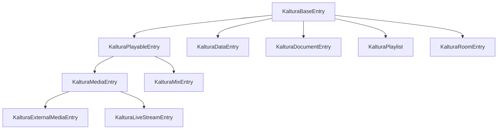
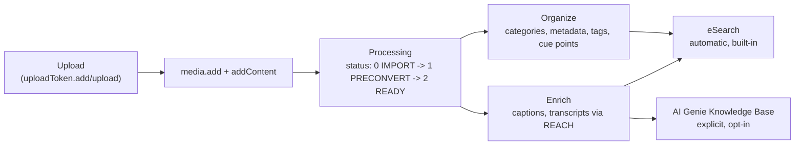

# Kaltura Content Model and Search Guide

Kaltura organizes every piece of content around a single object — the entry — and layers organization, metadata, and enrichment on top of it. This guide explains that data model end to end, then covers the two independent, live-tested ways content becomes searchable: eSearch (built-in, automatic) and the AI Genie Knowledge Base (explicit, RAG-oriented).

**Base URL:** `$KALTURA_SERVICE_URL` — see [Getting Credentials](KALTURA_GETTING_CREDENTIALS.md). Section 9 also uses `$KALTURA_GENIE_URL` — see [AI Genie API](KALTURA_AI_GENIE_API.md).  
**Auth:** KS as `ks` form parameter for v3 calls; `Authorization: KS $KALTURA_KS` header for AI Genie calls  
**Format:** Form-encoded POST for v3 (`format=1` for JSON responses); JSON body for AI Genie  

<!-- Sections: 1.When to Use | 2.Prerequisites | 3.The Entry Object Model | 4.Organizing Content: Categories, Metadata, Tags, and Cue Points | 5.Assets: Files Attached to Entries | 6.Enrichment with REACH | 7.From Upload to Searchable: The Full Pipeline | 8.Checking Search Readiness with eSearch | 9.Building and Checking an AI Genie Knowledge Base | 10.Error Handling | 11.Best Practices | 12.Related Guides -->

# 1. When to Use

- **Designing a new integration** — understand how entries, categories, metadata, tags, and cue points fit together before choosing where to store structured data.
- **Building a search experience** — decide whether eSearch's automatic full-text index or a purpose-built AI Genie Knowledge Base (for RAG/conversational search) fits your use case, and how to confirm content is ready in each.
- **Debugging "why can't I find this entry"** — trace the pipeline from upload through processing to indexing, and identify which stage the entry hasn't reached yet.
- **Grounding a conversational AI agent in your content** — build and verify an AI Genie Knowledge Base for RAG-based question answering.

# 2. Prerequisites

- **Kaltura Session (KS):** Required for every call in this guide. See [Session Guide](KALTURA_SESSION_GUIDE.md).
- **At least one entry:** Follow [Upload & Ingestion](KALTURA_UPLOAD_AND_INGESTION_API.md) to create and process a media entry before testing search or indexing behavior.
- **Service URL:** Set `$KALTURA_SERVICE_URL` per [Getting Credentials](KALTURA_GETTING_CREDENTIALS.md), and for Section 9, `$KALTURA_GENIE_URL` per [AI Genie API](KALTURA_AI_GENIE_API.md).
- **Familiarity with entry statuses:** `-2`=ERROR_IMPORTING, `-1`=ERROR_CONVERTING, `0`=IMPORT, `1`=PRECONVERT, `2`=READY, `3`=DELETED, `4`=PENDING, `5`=MODERATE, `6`=BLOCKED, `7`=NO_CONTENT. This guide refers to these throughout — see [Upload & Ingestion](KALTURA_UPLOAD_AND_INGESTION_API.md) for the full lifecycle.

# 3. The Entry Object Model

Every piece of content in Kaltura is an entry — a `KalturaBaseEntry` subtype. The subtype determines what the entry represents and which actions apply to it.



| Class | Represents |
|-------|-----------|
| `KalturaBaseEntry` | Abstract root — every entry type inherits from this |
| `KalturaPlayableEntry` | Abstract — entries with a player-relevant duration |
| `KalturaMediaEntry` | Video, audio, or image content (the most common entry type) — narrowed by `mediaType`: `1`=VIDEO, `2`=IMAGE, `5`=AUDIO |
| `KalturaMixEntry` | A composed/edited entry produced by the Video Editing API |
| `KalturaExternalMediaEntry` | A pointer to media hosted outside Kaltura |
| `KalturaLiveStreamEntry` | A live stream (RTMP/RTSP ingest) |
| `KalturaDataEntry` | Arbitrary structured data with no playable media — for example an HTML file, a plain-text file, or a 3D model file |
| `KalturaDocumentEntry` | Documents (PDF, Office files) — direct child of `KalturaBaseEntry`, not `KalturaPlayableEntry` |
| `KalturaPlaylist` | An ordered collection of other entries |
| `KalturaRoomEntry` | A virtual room (used by Kaltura Room / Events Platform) |

`entry.type` (`KalturaEntryType`) tells you which of these subtypes an entry is — for example `1`=MEDIA_CLIP, `5`=PLAYLIST, `6`=DATA, `7`=LIVE_STREAM, `10`=DOCUMENT.

Retrieve any entry's full object graph with `baseEntry.get`:

```bash
curl -X POST "$KALTURA_SERVICE_URL/service/baseEntry/action/get" \
  -d "ks=$KALTURA_KS" \
  -d "format=1" \
  -d "entryId=$KALTURA_ENTRY_ID"
```

# 4. Organizing Content: Categories, Metadata, Tags, and Cue Points

Four independent mechanisms attach organizational or descriptive data to an entry. They serve different purposes and are queried differently — use the table below to pick the right one.

| Mechanism | Lives on | Shape | Query with | Guide |
|-----------|----------|-------|------------|-------|
| **Categories** | `categoryEntry` (join between entry and category) | Many-to-many hierarchy; up to 32 categories per entry by default (1000 with `FEATURE_DISABLE_CATEGORY_LIMIT`) | `categoryEntry.list`, `category.list`, eSearch category filters | [Categories & Entitlements](KALTURA_CATEGORIES_AND_ENTITLEMENTS_API.md) |
| **Custom Metadata** | `metadata_metadata` (XML per metadata profile, per object) | Structured, schema-validated fields defined by an XSD | `metadata.list`, eSearch `KalturaESearchEntryMetadataItem` | [Custom Metadata](KALTURA_CUSTOM_METADATA_API.md) |
| **Tags** | `entry.tags` — a field directly on the entry object | A single comma-separated string, freeform | `baseEntry.get`/`update`, eSearch unified search | This guide |
| **Cue Points** | `cuePoint` service, referencing `entryId` | Many typed, timestamped markers per entry (chapter, slide, ad, annotation, quiz, code, event, session) | `cuePoint.list` (requires `entryIdEqual`/`entryIdIn`/`idEqual`/`idIn`) | [Cue Points Hub](KALTURA_CUE_POINTS_API.md) |

Tags live directly on the entry object — no separate service call is needed to read or write them:

```bash
curl -X POST "$KALTURA_SERVICE_URL/service/baseEntry/action/update" \
  -d "ks=$KALTURA_KS" \
  -d "format=1" \
  -d "entryId=$KALTURA_ENTRY_ID" \
  -d "baseEntry[objectType]=KalturaMediaEntry" \
  -d "baseEntry[tags]=onboarding,product-demo"
```

Choose the mechanism by what you're modeling: categories for hierarchical organization and entitlements, custom metadata for structured/validated fields you'll filter on, tags for lightweight freeform labels, and cue points for anything tied to a specific moment in playback.

# 5. Assets: Files Attached to Entries

Assets are the files attached to an entry — distinct from the organizational mechanisms in Section 4, which attach data rather than files.

| Asset type | Service | Holds |
|-----------|---------|-------|
| `flavorAsset` | `flavorAsset` | Transcoded media renditions (the actual playable files) |
| `thumbAsset` | `thumbAsset` | Thumbnail and preview images |
| `captionAsset` | `caption_captionAsset` | Subtitles, closed captions, transcripts |
| `attachmentAsset` | `attachment_attachmentAsset` | Non-media files (PDF, docs, and other attachments) |
| `fileAsset` | `fileAsset` | A generic file attached to an entry or a player (uiConf) — separate from the flavor/thumb/caption/attachment family above |
| `markdownAsset` | `attachment_attachmentAsset` | Markdown/text content attached to an entry — a specialized attachment, fed into AI Genie indexing (Section 9) |

Each asset type has its own dedicated guide: [Upload & Ingestion](KALTURA_UPLOAD_AND_INGESTION_API.md) (flavors), [Thumbnail API](KALTURA_THUMBNAIL_API.md), [Captions & Transcripts](KALTURA_CAPTIONS_AND_TRANSCRIPTS_API.md).

`fileAsset` follows the same upload-token content flow as other assets, but through its own service rather than the shared asset actions. Use it for app-owned state that doesn't belong in a searchable custom metadata schema — an interactive/branching video, for example, stores its node graph this way: one `fileAsset` per entry, keyed by `systemName`, holding the JSON the editing tool reads back to resume or re-render the graph.

```bash
curl -X POST "$KALTURA_SERVICE_URL/service/fileAsset/action/add" \
  -d "ks=$KALTURA_KS" \
  -d "format=1" \
  -d "fileAsset[objectType]=KalturaFileAsset" \
  -d "fileAsset[fileAssetObjectType]=3" \
  -d "fileAsset[objectId]=$KALTURA_ENTRY_ID" \
  -d "fileAsset[name]=Speaker Notes"
```

`fileAssetObjectType` (`KalturaFileAssetObjectType`) takes the object's numeric value, not its name — `2` for a uiConf, `3` for an entry. Set `systemName` to a stable identifier when an entry can carry more than one `fileAsset` — it's how you tell them apart, since `fileAsset.list` only filters by `objectId` and `fileAssetObjectType`, not by name:

```bash
curl -X POST "$KALTURA_SERVICE_URL/service/fileAsset/action/add" \
  -d "ks=$KALTURA_KS" \
  -d "format=1" \
  -d "fileAsset[objectType]=KalturaFileAsset" \
  -d "fileAsset[fileAssetObjectType]=3" \
  -d "fileAsset[objectId]=$KALTURA_ENTRY_ID" \
  -d "fileAsset[name]=Project Data" \
  -d "fileAsset[systemName]=PROJECT_DATA" \
  -d "fileAsset[fileExt]=json"
```

Attach content with `fileAsset.setContent`. For text or JSON content, pass it directly with `KalturaStringResource` — no upload token needed:

```bash
curl -X POST "$KALTURA_SERVICE_URL/service/fileAsset/action/setContent" \
  -d "ks=$KALTURA_KS" \
  -d "format=1" \
  -d "id=$FILE_ASSET_ID" \
  -d "contentResource[objectType]=KalturaStringResource" \
  -d "contentResource[content]={\"key\":\"value\"}"
```

For binary files, use the same `uploadToken.add` → `uploadToken.upload` → `KalturaUploadedFileTokenResource` flow used for flavors and attachments:

```bash
curl -X POST "$KALTURA_SERVICE_URL/service/fileAsset/action/setContent" \
  -d "ks=$KALTURA_KS" \
  -d "format=1" \
  -d "id=$FILE_ASSET_ID" \
  -d "contentResource[objectType]=KalturaUploadedFileTokenResource" \
  -d "contentResource[token]=$UPLOAD_TOKEN_ID"
```

`fileAsset.list` requires both `objectIdEqual` and `fileAssetObjectTypeEqual` on the filter — omitting either fails validation. Match on `systemName` client-side to find a specific asset among several attached to the same entry:

```bash
curl -X POST "$KALTURA_SERVICE_URL/service/fileAsset/action/list" \
  -d "ks=$KALTURA_KS" \
  -d "format=1" \
  -d "filter[objectType]=KalturaFileAssetFilter" \
  -d "filter[objectIdEqual]=$KALTURA_ENTRY_ID" \
  -d "filter[fileAssetObjectTypeEqual]=3"
```

`markdownAsset` extends `attachmentAsset` — create it through the same `attachment_attachmentAsset` service used for other attachments, with `objectType=KalturaMarkdownAsset`:

```bash
curl -X POST "$KALTURA_SERVICE_URL/service/attachment_attachmentAsset/action/add" \
  -d "ks=$KALTURA_KS" \
  -d "format=1" \
  -d "attachmentAsset[objectType]=KalturaMarkdownAsset" \
  -d "attachmentAsset[filename]=notes.md" \
  -d "attachmentAsset[fileExt]=md" \
  -d "attachmentAsset[format]=5" \
  -d "entryId=$KALTURA_ENTRY_ID"
```

Attach content the same way as any attachment asset — `attachment_attachmentAsset.setContent` with an uploaded token. Retrieve or list it with `attachment_attachmentAsset.get` (parameter name `attachmentAssetId`, not `id`) or `.list` — both return `objectType=KalturaMarkdownAsset` alongside other attachment types.

Set `accuracy` (0-100) and `providerType` (`KalturaMarkdownProviderType`) when the markdown comes from an automated pipeline — a Content Lab summary or an auto-generated chapter outline, for example. `accuracy` lets a Genie-backed assistant weight or filter out low-confidence generated content before treating it as a trusted answer source, and `providerType` records where the text came from when a knowledge base blends manually authored docs with generated ones. A markdown asset attached this way becomes part of the Genie-searchable corpus without touching the entry's own playable content — useful for pairing a training video with a text runbook so questions get answered from the checklist rather than from video transcription.

# 6. Enrichment with REACH

REACH orders enrichment services — captions, translation, dubbing, moderation, and more — that land on an entry as new assets or metadata once complete. This is the platform's built-in way to enrich content rather than building custom transcription or translation pipelines. Enrichment output (captions, transcripts, document attachments) is exactly what feeds both eSearch's caption/metadata search and AI Genie's automatic content indexing described below. See [REACH API](KALTURA_REACH_API.md) for the full 23-service-type catalog.

# 7. From Upload to Searchable: The Full Pipeline



Two independent tracks pick up a READY entry:

- **eSearch** indexes entry fields, tags, custom metadata, and captions automatically — no setup required. See Section 8.
- **AI Genie Knowledge Base** requires you to explicitly create a Knowledge record and assign categories or upload content to it before it indexes anything for conversational RAG. See Section 9.

An entry can feed both tracks at once — they don't conflict, and building a Knowledge base doesn't remove content from eSearch.

# 8. Checking Search Readiness with eSearch

eSearch (Elasticsearch-based) is enabled by default on every Kaltura account and indexes entries automatically — there's no separate "start indexing" call. Indexing is gated by entry status, not by elapsed time: an entry in `NO_CONTENT` status (`7`, created via `media.add` with no content ever uploaded) is not indexed and is not found by eSearch, no matter how long it has existed. An entry that has reached `READY` status (`2`) is found immediately.

Kaltura does not expose a dedicated "is this entry indexed" field or action. Treat eSearch findability itself as the status signal — once you expect an entry to be `READY`, poll `searchEntry` for its exact name or ID:

```bash
curl -X POST "$KALTURA_SERVICE_URL/service/elasticsearch_esearch/action/searchEntry" \
  -d "ks=$KALTURA_KS" \
  -d "format=1" \
  -d "searchParams[objectType]=KalturaESearchEntryParams" \
  -d "searchParams[searchOperator][objectType]=KalturaESearchEntryOperator" \
  -d "searchParams[searchOperator][searchItems][0][objectType]=KalturaESearchEntryItem" \
  -d "searchParams[searchOperator][searchItems][0][itemType]=3" \
  -d "searchParams[searchOperator][searchItems][0][fieldName]=name" \
  -d "searchParams[searchOperator][searchItems][0][searchTerm]=$KALTURA_ENTRY_NAME"
```

A `totalCount` of `0` while the entry is still processing (status other than `2`) means the entry hasn't reached an indexable state yet — not an error. A `totalCount` greater than `0` confirms the entry is both `READY` and indexed. See [eSearch API](KALTURA_ESEARCH_API.md) for the full search item catalog, including caption and metadata search.

# 9. Building and Checking an AI Genie Knowledge Base

AI Genie's automatic indexing pipeline (described in [AI Genie API](KALTURA_AI_GENIE_API.md)) picks up captions, transcripts, OCR text, and document attachments from entries assigned to configured categories, embeds them, and stores them for conversational retrieval (RAG). The `/v1/knowledge/*` endpoints on the AI Genie microservice are the explicit, structured way to build and manage a named knowledge base for this purpose.

## 9.1 Create a Knowledge record

```bash
curl -X POST "$KALTURA_GENIE_URL/v1/knowledge/add" \
  -H "Authorization: KS $KALTURA_KS" \
  -H "Content-Type: application/json" \
  -d '{
    "name": "Product Documentation",
    "config": {
      "sources": [
        {
          "type": "internal",
          "language": "en",
          "categoryIds": ["$CATEGORY_ID"],
          "indexers": [
            { "index_position": 0, "type": 1, "strategy": "EmbedCaptionV1" }
          ]
        }
      ]
    }
  }'
```

Returns a `Knowledge` object with a numeric `id`. `config.sources` supports two source types:

| Source `type` | Fields | Indexes |
|---|---|---|
| `internal` | `language`, `categoryIds`, `indexers` (`EmbedCaptionV1`, `EmbedOcrV1`, `EmbedDocumentV1`, and similar strategies) | Kaltura entries assigned to the listed categories |
| `web` | `urls` | Public web pages fetched and indexed directly |

## 9.2 Add content to the Knowledge base

A Knowledge base indexes whatever entries belong to its configured categories (`config.sources[].categoryIds` from Section 9.1) — there's no dedicated upload endpoint on the Genie microservice. Add content with the standard entry, upload, and category APIs.

Create a document entry:

```bash
curl -X POST "$KALTURA_SERVICE_URL/service/baseEntry/action/add" \
  -d "ks=$KALTURA_KS" \
  -d "format=1" \
  -d "entry[objectType]=KalturaDocumentEntry" \
  -d "entry[name]=Intro to Product Features" \
  -d "entry[type]=10" \
  -d "entry[documentType]=11"
```

Upload the file to an upload token (`uploadToken.add` then `uploadToken.upload` — see [Upload & Ingestion](KALTURA_UPLOAD_AND_INGESTION_API.md) for the chunked upload flow), then attach it to the entry:

```bash
curl -X POST "$KALTURA_SERVICE_URL/service/document_documents/action/addContent" \
  -d "ks=$KALTURA_KS" \
  -d "format=1" \
  -d "entryId=$KALTURA_ENTRY_ID" \
  -d "resource[objectType]=KalturaUploadedFileTokenResource" \
  -d "resource[token]=$UPLOAD_TOKEN_ID"
```

Assign the entry to one of the Knowledge base's configured categories — this is the step that actually puts it in scope for indexing:

```bash
curl -X POST "$KALTURA_SERVICE_URL/service/categoryEntry/action/add" \
  -d "ks=$KALTURA_KS" \
  -d "format=1" \
  -d "categoryEntry[objectType]=KalturaCategoryEntry" \
  -d "categoryEntry[categoryId]=$CATEGORY_ID" \
  -d "categoryEntry[entryId]=$KALTURA_ENTRY_ID"
```

`categoryId` must be one of the ids already listed in the Knowledge record's `config.sources[].categoryIds` — assigning an entry to any other category does not feed this Knowledge base. For plain text or markdown content, attach it as a `markdownAsset` instead of setting it as the entry's primary content (Section 5) — the indexing pipeline reads markdown from that asset type specifically.

## 9.3 Link the Knowledge base to an agent

Pass the Knowledge record's `id` as `knowledge_ids` and set `capabilities.use_knowledge_base` to `"on"` in the same intellect create or update call — not as a follow-up patch. `knowledge_ids` accepts only one record despite the array shape; to ground one agent in multiple sources, add multiple `sources` entries to a single Knowledge record instead of linking several records. See [Agentic Avatars](KALTURA_CONVERSATIONAL_AVATAR_API.md) for the full intellect/agent lifecycle.

## 9.4 Check indexing status

Content indexing into a Knowledge base runs asynchronously in the background after you upload content or assign categories — captions, transcripts, OCR text, and document content are extracted, embedded, and stored on their own schedule, independent of the API call that triggered them.

Retrieve the record with `/v1/knowledge/get`:

```bash
curl -X POST "$KALTURA_GENIE_URL/v1/knowledge/get" \
  -H "Authorization: KS $KALTURA_KS" \
  -H "Content-Type: application/json" \
  -d '{"id": '"$KNOWLEDGE_ID"'}'
```

The response's `status` field (`KnowledgeStatus`: `READY` or `DELETED`) confirms the record exists and hasn't been deleted — it's set as soon as you create the record and does not change as content finishes indexing. Do not use it to detect indexing completion.

There is no dedicated field for per-content indexing completion today. Use the same pattern as eSearch in Section 8: treat successful retrieval as your readiness signal. After uploading content and linking the Knowledge base to an agent (Section 9.3), query the agent with a question the new content should answer, and retry with a short backoff (for example 5s, 10s, 15s, 20s, 30s) until the response is grounded in that content. A response that doesn't yet reflect the new content means indexing is still in progress, not that something failed.

# 10. Error Handling

| Error / Symptom | Cause | Handling |
|---|---|---|
| `INVALID_KS` / `MISSING_KS` | KS missing, malformed, or expired | Re-issue a KS — see [Session Guide](KALTURA_SESSION_GUIDE.md) |
| `SERVICE_FORBIDDEN` | Action requires elevated/internal privileges not available on a standard customer KS | Use the customer-accessible paths documented in this guide (eSearch findability, AI Genie retrieval checks) rather than internal actions |
| eSearch `totalCount: 0` | Entry hasn't reached `READY` status yet, or has no indexable content (`NO_CONTENT`, status `7`) | Not an error — wait for the entry to reach `READY`, then retry |
| AI Genie `422` on `/v1/knowledge/*` | Request body fails schema validation (e.g., malformed `config.sources`) | Check the field against the schemas in Section 9.1 |
| AI Genie `400 bad_request` on more than one `knowledge_ids` entry | Genie enforces exactly one Knowledge record per intellect | Add multiple `sources` to a single Knowledge record instead of linking several records |

# 11. Best Practices

- **Pick the right organizational mechanism up front.** Use categories for hierarchy and entitlements, custom metadata for structured/filterable fields, tags for lightweight freeform labels, and cue points for anything tied to a playback timestamp.
- **Wait for `READY` before treating content as searchable.** An entry needs to reach status `2` and, for AI Genie indexing, needs extractable text (captions, OCR, or document content) — video or audio alone doesn't index into a Knowledge base without one of these.
- **Use eSearch findability as your indexing signal.** There's no dedicated status field — poll `searchEntry` for the entry's name or ID once you expect it to be `READY`.
- **Consolidate Knowledge sources instead of stacking records.** `knowledge_ids` accepts exactly one record per agent — add every source your agent needs to that one record's `sources` array.
- **Set `use_knowledge_base` and `knowledge_ids` together.** Writing them in the same intellect create/update call avoids a race with the up-to-24-hour partner-config cache that a two-step create-then-update risks hitting.
- **Treat retrieval as your indexing signal for AI Genie, not `status`.** `/v1/knowledge/get`'s `status` field only confirms the record exists — it doesn't reflect indexing progress. Query the agent with a question your new content should answer and retry with backoff until the response is grounded in it, the same pattern used for eSearch findability.
- **Use REACH for enrichment.** Generate captions, transcripts, and translations through REACH rather than a custom pipeline — the output feeds both eSearch and AI Genie indexing automatically.

# 12. Related Guides

- **[Session (KS) Guide](KALTURA_SESSION_GUIDE.md)** — Generate and manage the KS required for every call in this guide
- **[Upload & Ingestion API](KALTURA_UPLOAD_AND_INGESTION_API.md)** — Create and process entries, the starting point of the pipeline in Section 7
- **[eSearch API](KALTURA_ESEARCH_API.md)** — Full search item catalog, caption search, metadata search, facets
- **[Categories & Entitlements API](KALTURA_CATEGORIES_AND_ENTITLEMENTS_API.md)** — Category hierarchy, membership, and entitlement enforcement
- **[Custom Metadata API](KALTURA_CUSTOM_METADATA_API.md)** — XSD schemas and structured metadata fields
- **[Cue Points & Interactive Video API](KALTURA_CUE_POINTS_API.md)** — Temporal metadata markers referenced in Section 4
- **[Captions & Transcripts API](KALTURA_CAPTIONS_AND_TRANSCRIPTS_API.md)** — Caption assets that feed both eSearch and AI Genie indexing
- **[REACH API](KALTURA_REACH_API.md)** — Enrichment services marketplace referenced in Section 6
- **[AI Genie API](KALTURA_AI_GENIE_API.md)** — Conversational AI search and the automatic indexing pipeline behind Section 9
- **[Agentic Avatars](KALTURA_CONVERSATIONAL_AVATAR_API.md)** — Intellect/agent lifecycle for linking a Knowledge base per Section 9.3
